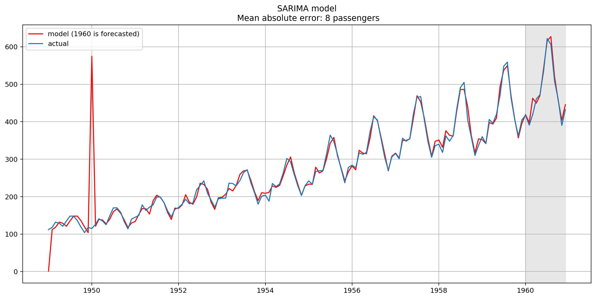

# Time Series Forecasting

* [`sarima-model.ipynb`](sarima-model.ipynb) – demo of SARIMA model forecasting air passengers number, time series having annual seasonality.



**Run Notebook**

```bash
docker run -d \
    -p 127.0.0.1:8884:8888 \
    -v "$PWD":/home/jovyan/work \
    --name time-series-forecasting \
    jupyter/datascience-notebook:latest

docker logs time-series-forecasting

# open http://127.0.0.1:8884/?token=**********
```
